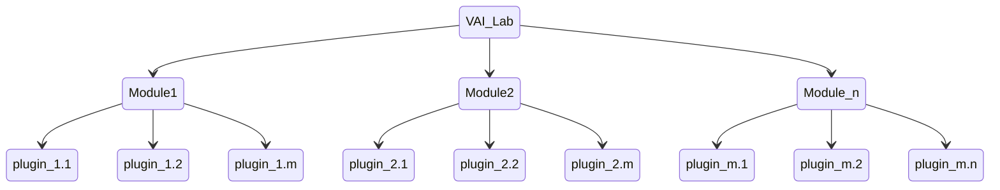

[](https://github.com/AaltoPML/VAI-Lab/actions/workflows/pythonpackage.yml) [](https://pypi.org/project/vai-lab/) [](https://pypi.org/project/vai-lab/) [](https://pypi.org/project/vai-lab/) [](https://pypi.org/project/vai-lab/)


# Virtual Artificially Intelligent Laboratories (VAI-Lab)


VAI-Lab is a modular, easy-to-use framework for Virtual Laboraties for science and design, where Artifical Intelligence assists the user in their goals.

> **Warning**
> This project is currently a work in progress and is intended for wider use when a full release is made.
>
> Users are welcome to use the software in its current state, but should expect to heavily alter source code until full testing has been done.
>
> Consult the development and release schedule for the intended timeline for this project.
>
> Any contributions, forks, or pull requests are very welcome. Feel free to get in touch

# How to Contribute

The aim of this framework is to be a community effort that will benefit science, engineering and more.

We are actively seeking contribution in the form of users, testers, developers, and anyone else who would like to contribute.

 - If you have methods which can be added to the framework, [get in touch](#Get-in-Touch)!
 - If you think this framework will be useful to your research, [get in touch](#Get-in-Touch)!
 - If want to get invovled in development, [get in touch](#Get-in-Touch)!
 - Noticed a bug or other issue? [get in touch](#Get-in-Touch)!

# How it Works

The VAI-Lab framework uses a modular, plugin-based architecture.



Each module represents a process (e.g. Modelling) and each plugin is a specific implementation of that process (e.g. linear regression).

Modules can be chained, looped and modified in real-time to create a highly customisable framework for the user's requirements.

## Installation

### Installing from package

To install the latest pip release:

```
pip install vai-lab
```

### Installing from source 

Clone this repository via HTTPS:
```bash
git clone https://github.com/AaltoPML/VAI-lab.git
```
OR SSH:
```bash
git clone git@github.com:AaltoPML/VAI-lab.git
```
Change directory
```bash
cd VAI-lab
```
Create a virtual environment and activate it using venv
```bash
python3 -m venv venv && source venv/bin/activate
```
or using conda
```bash
conda create --name vai_lab python=3.8 && conda activate vai_lab
```
Upgrade pip
```bash
python3 -m pip install -U pip
```
Install the package
```bash
python3 -m pip install .
```

## Running Unit Tests

Unit tests are run with pytest with
```bash
pytest
```


## Launching and Examples

### From Command Line

To launch the framework with the GUI:
```bash
vai_lab
```

To launch the framework with an existing config file
```bash
vai_lab --file <path_to_config_file>
```


### From Code

To launch the framework with the GUI:

```python
import vai_lab as ai

core = ai.Core()
core.run()
```

or to execute an existing config file:

```python
import vai_lab as ai

core = ai.Core()
core.load_config_file("<path_to_config_file>")
core.run()
```

### Examples

Pre-made [examples](https://github.com/AaltoPML/VAI-lab/tree/main/src/vai_lab/examples/xml_files) show the syntax and form of the config files and pipeline as a whole, and are the best way to get started.

Some basic use-cases are provided among many others:
 - [user_feedback_demo.xml](https://github.com/AaltoPML/VAI-lab/tree/main/src/vai_lab/examples/xml_files/user_feedback_demo.xml) Demonstrates manual image classification of chest X-rays
 - [canvas_demo.xml](https://github.com/AaltoPML/VAI-lab/tree/main/src/vai_lab/examples/xml_files/canvas_demo.xml) Launches the canvas state-action pair visualiser and editor
 - [regression_demo.xml](https://github.com/AaltoPML/VAI-lab/tree/main/src/vai_lab/examples/xml_files/regression_demo.xml) Demonstrates simple linear regression on a small set of sample data

#### Launching examples:

To demonstrate the syntax for launching examples using `user_feedback_demo.xml`.

Using the command line

```bash
vai_lab --file ./examples/xml_files/user_feedback_demo.xml
```

From code

```python
import vai_lab as ai

core = ai.Core()
core.load_config_file(("./examples/xml_files/user_feedback_demo.xml"))
core.run()
```

Absolute paths, as well paths relative to the library's base directory can be used.
For library-relative paths, starting a path definition with `"./"` defaults to the directory `<path_to_site_packages>/vai_lab/`

In addition to path strings, the config file paths can be passed as lists or tuples of directory paths. Therefore, the above command/code are equivalent to

```bash
vai_lab --file ./examples xml_files user_feedback_demo.xml
```

and 

```python
import vai_lab as ai

core = ai.Core()
core.load_config_file(("./examples","xml_files","user_feedback_demo.xml"))
core.run()
```


# Defining Pipelines in GUI

The VAIL module allows to define a pipeline and the relations within by drawing a flowchart on a canvas. This canvas always starts with an `initialiser` module and an `output` module and allows to define any number of modules between these two. To do so, the user needs to define the modules and the relations between them.


### Modules
At this moment, there are 7 possible modules for VAIL. `initialiser` and `output` are compulsory for the pipeline, the rest of them can be freely placed in the canvas. These are:
 - `Data processing`.
 - `Modelling`.
 - `Decision making`.
 - `User Feedback Adaptation`.
 - `Input data`.

If you click on a module and drag it you can modify its position on the canvas.
Finally, they can be deleted by clicking on the desired module and then clicking on the `Delete selection` button.

### Module joining
Each module object has a number of circles that can be used to join two modules. The initially clicked circle will be identified as the parent and the second one as the child (the output of the father is fed to the input of the child). There can be only one connection from each circle. As of this version, if you need to edit an existing connection you need to delete one of the connected modules.

### Loops
If you click on the canvas and drag, you can draw a rectangle that defines which modules are inside the loop. Upon releasing the button you are requested to input what type of loop you want and what condition should be fulfilled to end the loop.

## Pipeline uploading via XML file

The pipeline can also be defined uploading an existing XML file. The structure of the XML file is described in the Back-end section.

# Plugin Examples

### `manual_input`
Requires the user to indicate to which class the specified data corresponds to.
In the current example, the model needs to classify images and the model requires expert knowledge for specific images.
The user needs to indicate which classes correspond to the image and save the results to send them to the model.

### `canvas_input`
Requires the user to give feedback to state-action pairs.
It opens a tab for each interactable object in the model and either requires adding new state-action samples or to modify the existing ones.
In the current example, the model has two interactable objects that require feedback in two forms: (1) an _angle_ for the state and for the action or (2) a tuple of _Cartesian coordinates_ for the state and for the action. It has been adapted to be able to give feedback to any number of objects. These, at the same time, can be either `sliding` or `rotating` objects. Specifically, `sliding` refers to objects that need Cartesian feedback in a two-dimensional space, while `rotating` refers to objects that require an angle. In order to give feedback, you can choose to either move the corresponding state-action pairs on the canvas or directly edit the tree view display. This last option results in an automatic update on the canvas of the state-action location.

## Defining a pipeline in XML

The pipeline structure is defined between the `pipeline` tags:
```XML
<pipeline>
    ...
</pipeline>
```

### Initialise
The `Initialise` tag is the dedicated entry point to the pipeline. No other entry points can be declared.

Current options:
 - `name`: attribute for user defined name
 - `initial_data`: element for declaring directory for initial data
 - `relationships`: User defined names of modules this one is connected to

Example from [canvas_demo.xml](https://github.com/AaltoPML/VAI-lab/tree/main/src/vai_lab/examples/xml_files/canvas_demo.xml)
```XML
<Initialiser name="Init">
        <inputdata>
            <X file="./examples/state-action/X_data.csv" />
        </inputdata>
        <relationships>
            <child name="My First UserFeedback Module" />
        </relationships>
    </Initialiser>
```

### Loops
Loop tags are used to iterate over a given set of modules until a condition is met. Loops can be nested and named.  

See [basic_operation.py](https://github.com/AaltoPML/VAI-lab/tree/main/src/vai_lab/examples/xml_files/basic_operation.xml) for full example.
Current options:
 - `type`: what variety of loop will this be: `for`, `while`, `manual`(user defined stopping condition on-the-fly)
 - `condition`: Termination condition for the loop. I'm not sure how to deal with the criteria for `while` loops
 - `name`: User defined name for loop
```XML
<loop type="for" condition="10" name="For Loop 1">
    ...
</loop>
```

### Modules
Modules are declared by tags matching their names, e.g. the GUI module is loaded with the `GUI` tag:

Required:
 - `name`: Unique user defined name for module, so can be referenced later
 - `plugin`: The type of plugin to be loaded into the module, along with associated options.
 - `relationships`: User-defined names of the `parent` modules which this module receives data from and `child` modules that this module passes data to.

Example from [ridge_regression_demo.xml](https://github.com/AaltoPML/VAI-lab/tree/main/src/vai_lab/examples/xml_files/ridge_regression_demo.xml):
```XML
     <Modelling name="Modelling">
        <relationships>
            <parent name="Initialiser" />
            <child name="Output" />
        </relationships>
        <plugin type="RidgeRegression">
            <alpha>
                 0.02
            </alpha>
        </plugin>
    </Modelling>
```

## Data Definition

Data is loaded from existing files in either the `Initialiser` or `Input Data` modules and is specified using the `inputdata` tags.

Example from [ridge_regression_demo.xml](https://github.com/AaltoPML/VAI-lab/tree/main/src/vai_lab/examples/xml_files/ridge_regression_demo.xml):

```XML
<inputdata>
    <X file="./examples/supervised_regression/X_tr.csv" />
    <Y file="./examples/supervised_regression/Y_tr.csv" />
    <X_test file="./examples/supervised_regression/X_tst.csv" />
    <Y_test file="./examples/supervised_regression/Y_tst.csv" />
</inputdata>
```

### Writing Data
Two methods are given to add data to the XML file. One for modules (`append_pipeline_module_to_file`) and one for data structures (`append_data_structure_field_to_file`).

# Feature and Release Schedule :calendar:

- [ ] October/ November 2022: Public repo, API fixing, Testing
- [ ] January 2023: Representative use case release
- [ ] Spring 2023: Initial full release of manual pipeline
- [ ] Fall 2023: Initial release of preliminary AI-Assistance

# Get in Touch
If you would like contribute, test, give feedback, or ask questions about this framework, we'd like to hear from you!
Email us at:
- Chris McGreavy, chris.mcgreavy [at] aalto.fi
- Carlos Sevilla-Salcedo, carlos.sevillasalcedo [at] aalto.fi
